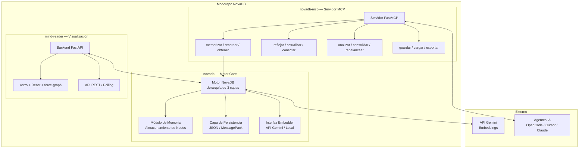
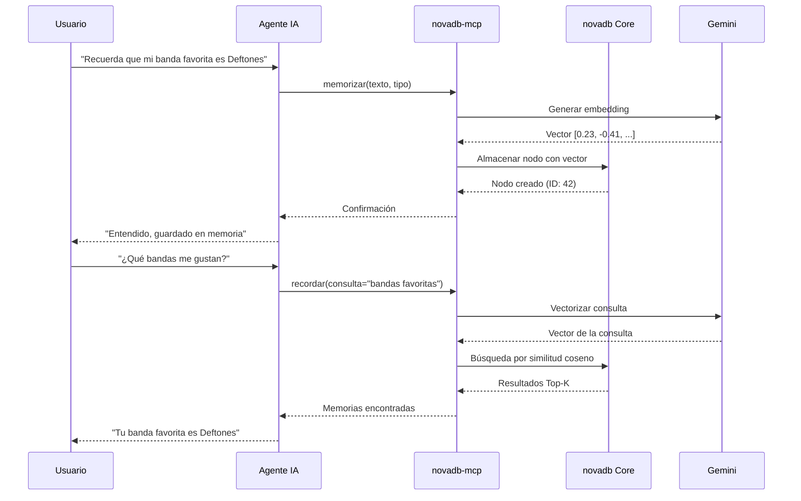
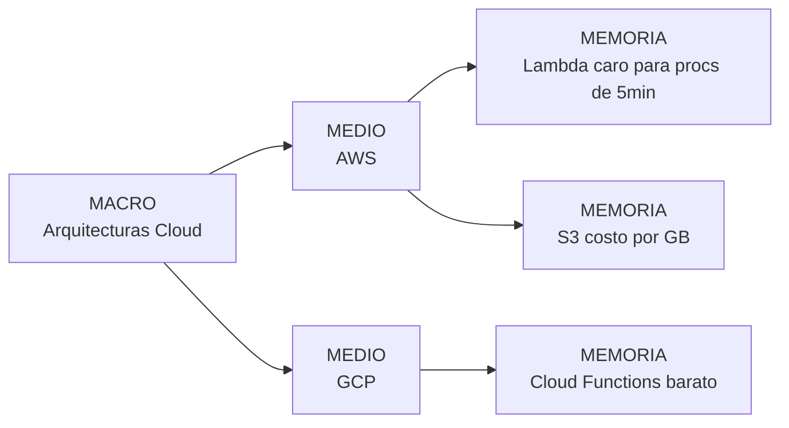

# Arquitectura — NovaDB

## Visión General del Sistema

## Flujo de Datos

## Modelo Jerárquico

## Stack Tecnológico

| Capa | Tecnología | Propósito |
|-------|-----------|---------|
| Core | Python, NumPy, msgpack | Motor semántico + persistencia binaria hiper-rápida |
| Embeddings | API Gemini / Local | Conversión de texto → vector (768 o 384 dimensiones) |
| MCP | FastMCP, Python | Puente de protocolo estándar para dotar de memoria a IA |
| Backend API | FastAPI | Endpoints REST para ingestar el grafo al visualizador |
| Frontend | Astro, React, 3D force-graph | Renderizado del grafo espacial y topológico interactivo |
| Tiempo Real | Polling / JSON Fetch | Actualización en vivo del estado de la memoria |
