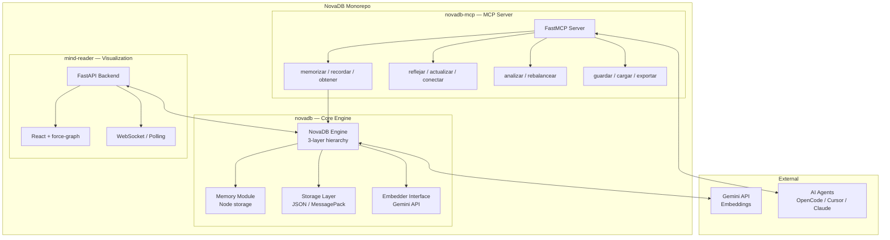
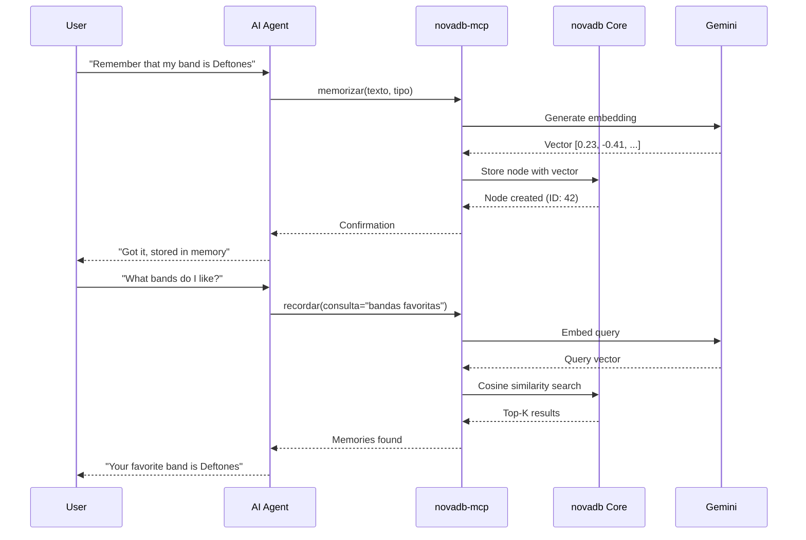
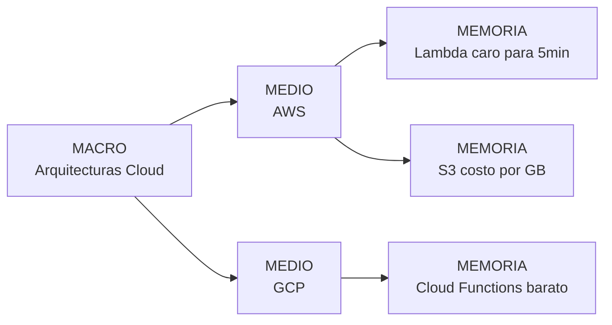

# Architecture — NovaDB

## System Overview

## Data Flow

## Hierarchy Model

## Tech Stack

| Layer | Technology | Purpose |
|-------|-----------|---------|
| Core | Python, NumPy, msgpack | Semantic engine + persistence |
| Embeddings | Gemini API | Text → vector conversion |
| MCP | FastMCP, Python | Protocol bridge for AI agents |
| Backend API | FastAPI | REST endpoints for visualization |
| Frontend | React, force-graph | Interactive graph rendering |
| Real-time | WebSocket / Polling | Live memory updates |
